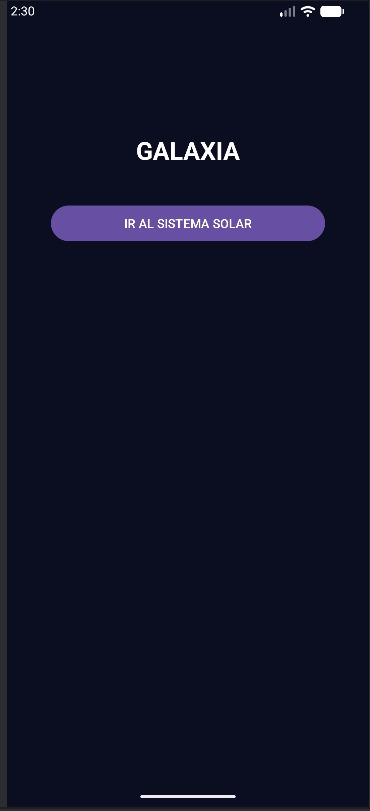
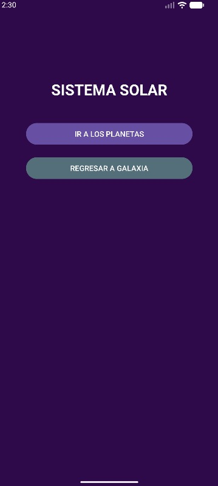
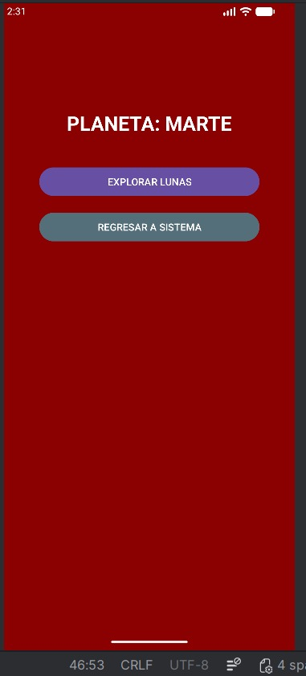
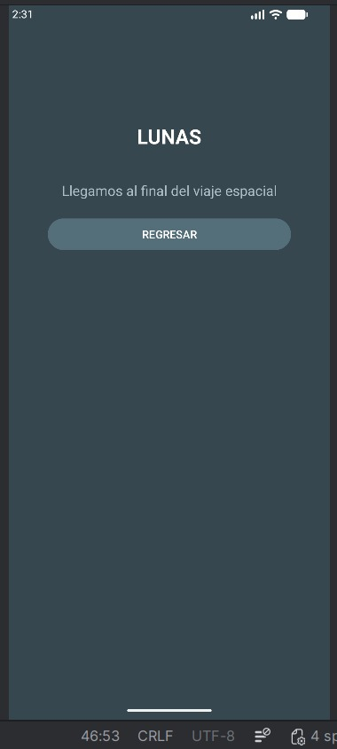

# PRACTICA 1: Explorador del Sistema Solar 🚀
## Descripción General
Este repositorio contiene la solución al Ejercicio 2 de Desarrollo de aplicaciones móviles nativas. El objetivo de esta aplicación es demostrar una navegación jerárquica fluida entre múltiples pantallas utilizando Intents y aplicando los conceptos clave del ciclo de vida de Android.

## Activities
La aplicación está estructurada en 4 niveles de profundidad. Cada Activity tiene un diseño visual único (basado en colores temáticos) para reflejar su nivel:
* MainActivity (Galaxia): Funciona como el menú principal. Contiene el título del nivel y el botón de acceso para iniciar la exploración hacia el Sistema Solar.
* SistemaSolarActivity: El segundo nivel de la jerarquía. Representa la entrada a nuestro sistema estelar y permite avanzar a los planetas.
* PlanetasActivity: El tercer nivel, enfocado en el planeta Marte, con la opción de explorar sus satélites naturales.
* LunasActivity: El último nivel de la jerarquía. Al ser el destino final, no cuenta con botones de avance, indicando al usuario que debe usar la navegación nativa de retroceso.

## Transiciones y Ciclo de vida
* Manejo de Transiciones: Las transiciones hacia adelante se manejan utilizando `Intents` explícitos. En cada Activity, se enlaza un botón mediante `findViewById` y se le asigna un `setOnClickListener`. Al presionarlo, se crea un Intent indicando la clase actual y la clase destino, ejecutándose con el método `startActivity(intent)`.
* Ciclo de Vida al Avanzar: Cuando el usuario avanza a un nivel más profundo (ej. de Galaxia a Sistema Solar), la Activity anterior ejecuta sus métodos `onPause()` y `onStop()`, quedando guardada en la pila de retroceso (Back Stack). Simultáneamente, la nueva Activity se instancia y ejecuta `onCreate()`, `onStart()` y `onResume()` para hacerse visible y activa.
* Ciclo de Vida al Retroceder: Dado que la jerarquía es lineal, el usuario retrocede utilizando el botón "Atrás" del sistema. Al hacerlo, la Activity actual se destruye (`onPause()`, `onStop()`, `onDestroy()`) y la Activity anterior se recupera del Back Stack, ejecutando `onStart()` y `onResume()`.

## Instrucciones de ejecución
Para probar esta aplicación en tu computadora, sigue estos pasos:
* Clona este repositorio usando Git: git clone [URL_DE_TU_REPOSITORIO]
* Abre *Android Studio*.
* Selecciona File > Open... y elige la carpeta del proyecto.
* Espera a que *Gradle* termine de sincronizar las dependencias.
* Inicia un Emulador de Android (AVD) o conecta un dispositivo físico mediante depuración USB.
* Haz clic en el botón verde *Run 'app'* (o presiona Shift + F10).

## Evidencias de Funcionamiento
### Menú principal

### Navegación

