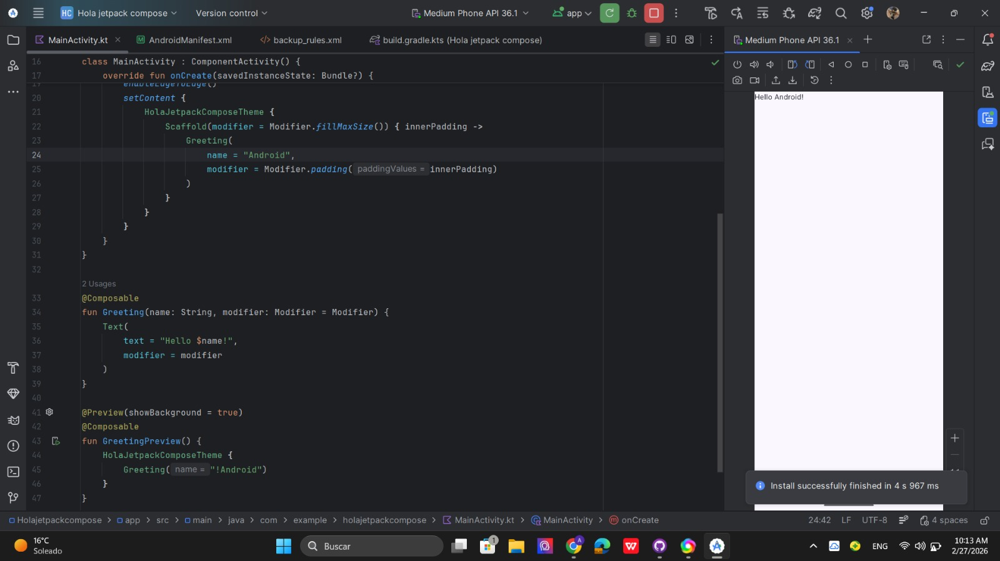
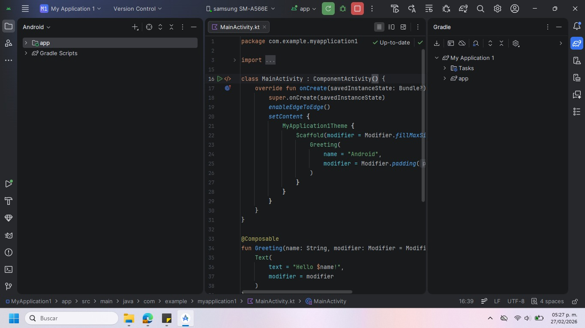
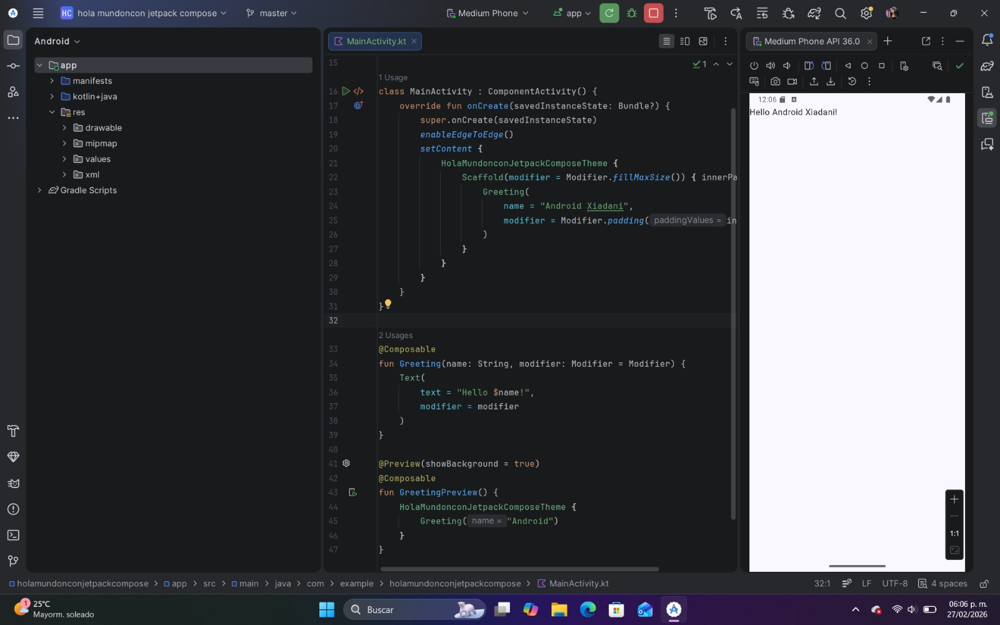

# Práctica 1: Instalación y Funcionamiento de los Entornos Móviles

## Ejercicio 1: Instalación de Herramientas
* Instrucciones: Cree una aplicación de prueba con flutter create hello_flutter y ejecútela en el emulador.
  
### Evidencias:
Tome capturas de pantalla del IDE mostrando el emulador con la aplicación "Hello Android" ejecutándose correctamente.
* Alejandra Benítez Leonardo
  

  * María Guadalupe Hernandez Alvirde
  
  

* Xiadani Alexahyatt Tadeo Martínez
  
